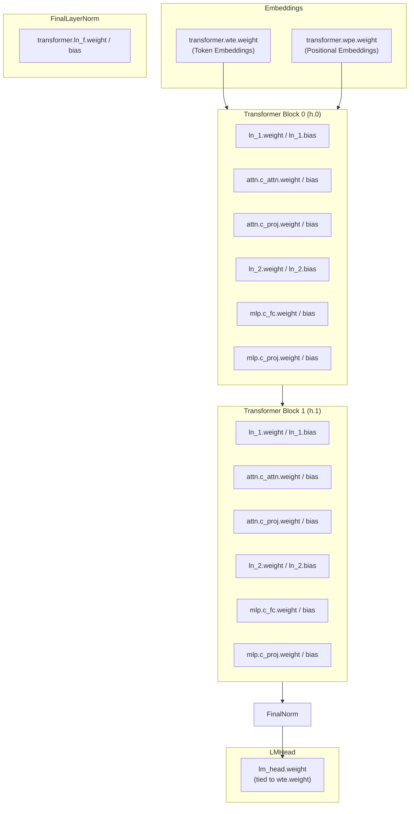

# GPT-2 Architecture (Tensor Mapping)

```mermaid
flowchart TD

    subgraph Embeddings
        WTE["transformer.wte.weight\n(Token Embeddings)"]
        WPE["transformer.wpe.weight\n(Positional Embeddings)"]
    end

    WTE --> Block0
    WPE --> Block0

    subgraph Block0["Transformer Block 0 (h.0)"]
        LN1_0["ln_1.weight / ln_1.bias"]
        ATTQKV_0["attn.c_attn.weight / bias"]
        ATTOUT_0["attn.c_proj.weight / bias"]
        LN2_0["ln_2.weight / ln_2.bias"]
        MLPFC_0["mlp.c_fc.weight / bias"]
        MLPPROJ_0["mlp.c_proj.weight / bias"]
    end

    Block0 --> Block1

    subgraph Block1["Transformer Block 1 (h.1)"]
        LN1_1["ln_1.weight / ln_1.bias"]
        ATTQKV_1["attn.c_attn.weight / bias"]
        ATTOUT_1["attn.c_proj.weight / bias"]
        LN2_1["ln_2.weight / ln_2.bias"]
        MLPFC_1["mlp.c_fc.weight / bias"]
        MLPPROJ_1["mlp.c_proj.weight / bias"]
    end

    Block1 --> FinalNorm

    subgraph FinalLayerNorm
        LNFinal["transformer.ln_f.weight / bias"]
    end

    FinalNorm --> LMHeadNode

    subgraph LMHead
        LMHeadNode["lm_head.weight\n(tied to wte.weight)"]
    end
```
